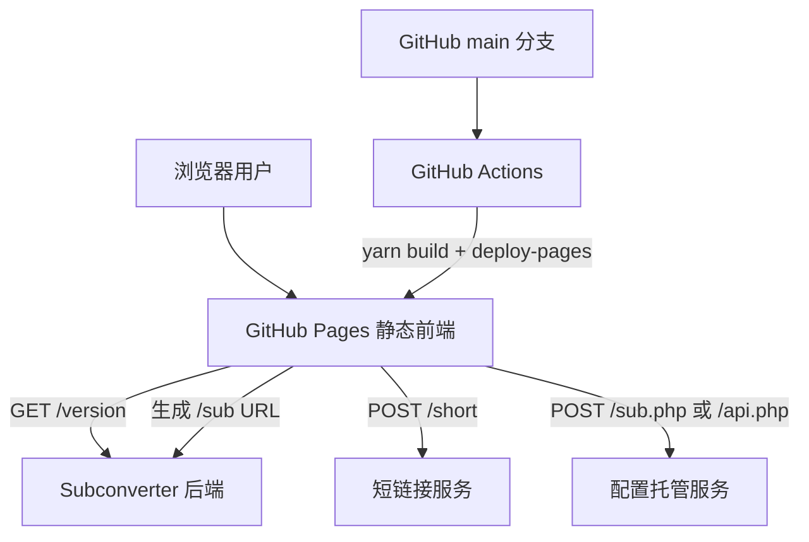
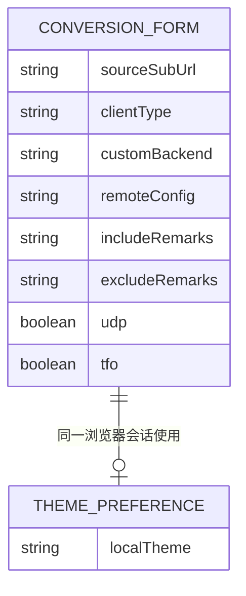
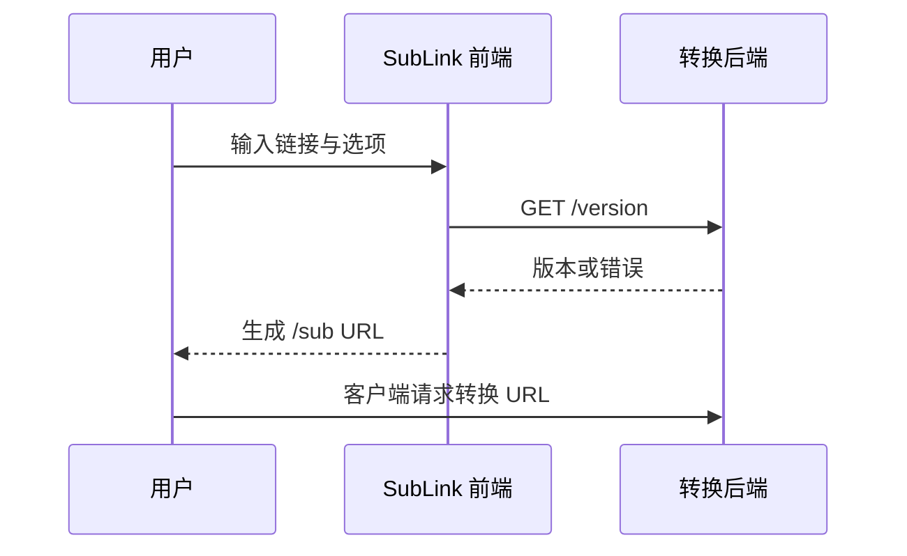

# SubLink — 系统架构

## 技术栈决策

| 层 | 推荐技术 | 备选 | 理由 |
| --- | --- | --- | --- |
| 前端 | Vue 2.7 + Element UI | Vue 3 + Naive UI | 直接复用稳定上游，最小改动 |
| HTTP | Axios + Fetch | 原生 Fetch | 兼容现有调用与拦截器 |
| 构建 | Vue CLI 5 + Yarn 1 | Vite | 现有锁文件和代码无需迁移 |
| 托管 | GitHub Pages + Actions | Vercel | 与用户 GitHub 账号直接集成、免费静态托管 |
| 转换服务 | 外部 Subconverter | 自建 Subconverter | 静态站不需要服务器 |

## 方案比较

| 方案 | 优点 | 代价 | 结论 |
| --- | --- | --- | --- |
| 保持 Vue 2 | 交付快、回归面小 | 技术栈较旧 | MVP 采用 |
| 迁移 Vue 3/Vite | 构建快、长期维护更好 | 需要重写 Element UI 和部分插件 | V2 评估 |

## 总体架构



## 数据模型

MVP 无数据库，状态仅存在于当前 Vue 实例和浏览器 `localStorage`。



## API 设计

本项目不提供自有 API。外部 Subconverter 目前采用未版本化路径；如未来增加自有适配层，统一放在 `/v1/` 下并通过适配器隔离第三方差异。

| 方法 | 路径 | 描述 |
| --- | --- | --- |
| GET | `{backend}/version` | 探测转换后端版本与可用性 |
| GET | `{backend}/sub?...` | 执行或表示订阅转换请求 |
| POST | `{shortBackend}/short` | 把长转换链接生成短链接 |
| POST | `{configBackend}/sub.php` | 上传自定义远程配置 |
| POST | `{configBackend}/api.php` | 上传脚本配置并生成链接 |

### 认证与授权

无用户体系、无登录、无 RBAC。GitHub Actions 使用仓库内置 `GITHUB_TOKEN` 的 `pages: write` 与 OIDC `id-token: write` 权限发布。



## 目录结构

```text
src/views/Subconverter.vue      核心转换界面与 URL 构造
src/plugins/                    Axios、剪贴板、设备识别
src/assets/css/                 明暗主题与组件样式
public/                         静态资源与入口 HTML
.github/workflows/deploy.yml    Pages CI/CD
subscription-conversion-sdlc/  产品和工程文档
```

## 部署架构

- 开发：本机 Node.js 20、Yarn 1、Vue CLI dev server。
- 生产：GitHub Actions 构建 `dist/`，GitHub Pages CDN 提供 HTTPS 静态资源。
- 网络：浏览器直连 GitHub Pages 和用户选择的第三方后端；无 VPC、子网或数据库。

